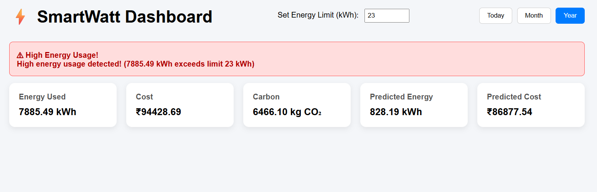

# ⚡ SmartWatt Dashboard

SmartWatt Dashboard is a full-stack energy monitoring system for households. It tracks real-time energy usage, calculates cost and carbon footprint, predicts future energy consumption using machine learning, and alerts when usage exceeds the limit.

**Dashboard Overview**  
.png)

**High Usage Alert**  
.png)

**Predicted Energy & Cost**  



##  Features

- Monitor real-time energy usage (kWh)
- Dynamic threshold & alerts for high energy usage
- Cost calculation based on usage
- Carbon footprint estimation
- Predicted energy using Python ML (Linear Regression)
- User login and registration
- Filter data by Today, Month, or Year

## Tech Stack

- **Frontend:** React.js, Bootstrap  
- **Backend:** Node.js, Express.js  
- **Database:** MySQL  
- **Machine Learning:** Python (Linear Regression)  
- **Security:** JWT, bcrypt

## Installation

1. Clone the repository:
```bash
git clone https://github.com/yourusername/smartwatt-dashboard.git
cd smartwatt-dashboard

2.Setup Backend:
cd backend
npm install
node server.js

3.Setup Frontend:
cd ../frontend
npm install
npm start

Run Python ML Script:
cd ../backend/ml
python energy_prediction.py 5,6,7,6,8,9

Make sure Python and required packages are installed.

Usage
Open dashboard in browser (http://localhost:3000)
Login with your credentials
View energy stats: Energy Used, Cost, Carbon, Predicted Energy & Cost
Set energy threshold to get alerts
Filter data by Today, Month, or Year

Future Enhancements
Connect real IoT devices for live data
SMS or email notifications for high energy usage
Add more appliances with detailed readings
Interactive charts and graphs

Folder Structure
smartwatt-dashboard/
├─ backend/          # Node.js server, APIs, Python ML script
├─ frontend/         # React app
├─ screenshots/      # Images for README
└─ README.md

License
MIT License
---
This version is **perfect for a fresher’s GitHub repo**: clear, professional, and easy to read.  
If you want, I can also make an **even shorter, one-page version** that fits in **less than 150 lines**, perfect for recruiters to quickly scan — very attractive for fresher projects.  
Do you want me to do that?

